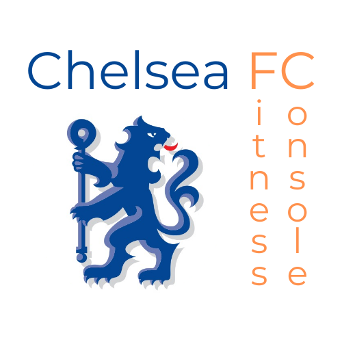

# CFC-Vizathon

Welcome to my **CFC-Vizathon** entry! This repository contains the source code for my entry which can be viewed online here: [Chelsea Fitness Console](https://ta-cfc-vizathon.onrender.com/)

## Table of Contents

- [CFC-Vizathon](#cfc-vizathon)
  - [Table of Contents](#table-of-contents)
  - [About](#about)
  - [Installation](#installation)

## About

More information about the competition can be found here: [CFC Vizathon](https://chelsea-fc-performance-insights.github.io/Competition/#home)

## Installation

If you are interested in running this project locally, follow these steps:

1. Clone the repository:
    ```bash
    git clone https://github.com/ThomasAston/CFC-Vizathon.git
    ```
2. Navigate to the project directory:
    ```bash
    cd CFC-Vizathon
    ```
3. Install dependencies:
    ```bash
    pip install -r requirements.txt
    ```
4. Run the application:
    ```bash
    python app.py
    ```